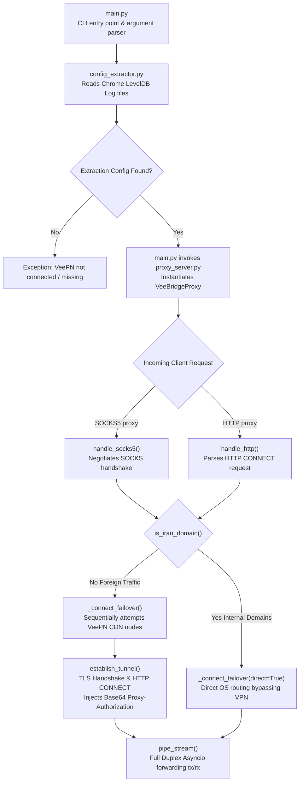

<div align="center">

# 🌉 VeeBridge Gateway

**The Ultimate Reverse-Engineered Local Proxy Gateway for VeePN Extension**

[](https://python.org)
[](https://docs.python.org/3/library/asyncio.html)
[](LICENSE)
[]()

**[English](#-english)** • **[فارسی](#-فارسی)**

</div>

<a id="-english"></a>
## 🇬🇧 English

### 📑 Table of Contents
- [Overview](#overview)
- [Features](#features)
- [Architecture](#architecture)
- [Project Structure](#project-structure)
- [Requirements](#requirements)
- [Installation](#installation)
- [Usage Configuration](#usage)
- [Security Notes](#security-notes)
- [Responsible Use](#responsible-use)

### 📌 Overview
**VeeBridge** is a zero-configuration, lightweight Python utility built on top of native `asyncio`. It bridges your universally trusted Chrome **VeePN** Extension into a robust system-wide local proxy. By actively parsing Chrome's secure LevelDB storage, it extracts connection credentials and dynamic egress proxy nodes securely, enabling any application on your machine (like Telegram, Git, Discord, or v2rayN) to utilize the secure VeePN infrastructure.

### ✨ Features
- 🛡️ **Zero-Dependencies**: Runs purely on Python's Standard Library natively without PIP packages.
- ⚡ **Zero-Config Credentials**: Automatically extracts VeePN Server IPs, Usernames, and Passwords completely dynamically.
- 🔀 **Multiplexed Protocols**: Concurrently exposes a local SOCKS5 proxy (e.g. `:1080`) and an HTTP proxy (e.g. `:8080`).
- 🇮🇷 **Smart Split Tunneling**: The `--bypass-iran` flag intelligently resolves domestic `.ir` or Iranian intranet domains, routing them directly through your local ISP to avoid blocking local services.
- 🛡️ **Auto-Failover Matrix**: If a VeePN CDN node drops the connection, VeeBridge automatically reconnects the stream to the next active proxy node silently.
- 📊 **Keyboard Live Metrics**: Monitor active simultaneous connections, Upload (TX), and Download (RX) logs by simply pressing `Enter` on your terminal.
- 💻 **Pure Hacker CLI Environment**: Zero bloated interactive UIs. Handled purely by argparse with scrolling richly color-coded debug logs.

### 🏗️ Architecture



### 📁 Project Structure
```text
VeeBridge/
├── main.py                # Command-line entry point and logic hub
├── proxy_server.py        # Asyncio tunneling, multiplexing, and routing engine
├── config_extractor.py    # Chrome LevelDB logic parser and credential extractor
├── requirements.txt       # Python dependencies (Rich)
└── README.md              # You are here
```

### ⚙️ Requirements
- **Python:** Version `3.11` or higher.
- **Google Chrome:** Installed on Windows default directory.
- **VeePN Extension:** Logged in and actively connected on Chrome prior to starting.

### 📥 Installation 
```bash
git clone https://github.com/your-username/VeeBridge.git
cd VeeBridge
```

### 🚀 Usage Configuration

Launch the script using any of the available command-line flags. Below is the flag matrix:

| Flag / Command | Description | Default |
| :--- | :--- | :--- |
| `-r` or `--run` | Initialize and start the routing proxy engine. | `False` |
| `-p` or `--port` | The local port to bind the SOCKS5 gateway. | `1080` |
| `--http-port` | The local port to bind the HTTP Proxy gateway. | `<Disabled>` |
| `-b` or `--bypass-iran` | Enable Domain Split-Tunneling (.ir and Iranian IP blocks). | `False` |
| `-d` or `--debug` | Enables rigorous stream and connectivity debug logs. | `False` |
| `-s` or `--status` | Read config parameters silently without starting proxy. | `False` |

**Full Launch Example:**
```bash
python main.py -r -p 1080 --http-port 8080 --bypass-iran --debug
```

### 🔐 Security Notes
- This program directly accesses Chrome local databases. Do **NOT** expose your `.ldb` proxy keys on public forums or share extracted API tokens.
- Add `.env` and `__pycache__/` to your `.gitignore` to prevent any memory leakage if modifying variables. 

### ⚖️ Responsible Use
This codebase serves exclusively as an Open-Source network research prototype demonstrating native Python asynchronous routing. Please respect Google Chrome Extensibility Terms and VeePN Terms of Service. It bypasses no authentications; it merely forwards locally what is already authorized on the host node.

---

<br><br>

<a id="-فارسی"></a>
## 🇮🇷 فارسی

<div dir="rtl">

### 📑 فهرست مطالب
- [معرفی پروژه](#معرفی-پروژه)
- [امکانات](#امکانات)
- [معماری سیستم](#معماری-سیستم)
- [ساختار فایلها](#ساختار-فایلها)
- [پیشنیازها](#پیشنیازها)
- [آموزش نصب](#آموزش-نصب)
- [استفاده و پیکربندی](#استفاده-و-پیکربندی)
- [نکات امنیتی](#نکات-امنیتی)
- [استفاده مسئولانه](#استفاده-مسئولانه)

### 📌 معرفی پروژه
ابزار **VeeBridge** یک درگاه پراکسی محلی (Local Proxy) فوقالعاده سبک، قدرتمند و نوشتهشده بر پایه معماری غیرهمزمان پایتون (`asyncio`) است. وظیفه اصلی این پروژه، گره زدن زیرساخت امن و سریع اکستنشن **VeePN** مرورگر کروم، با کل سیستمعامل شماست. 
این ابزار با اسکن کردن زنده دیتابیس LevelDB کروم، یوزرنیم، پسورد و سرورهای مخفی خروجی (CDN) ویپیان را استخراج کرده و یک سرور واسط راهاندازی میکند تا هر برنامهای در سیستم (نظیر تلگرام، Git، v2rayN و غیره) بتواند از سرعت نرمافزار کروم استفاده کند.

### ✨ امکانات
- 🛡️ **بدون هیچگونه پیشنیاز (Zero-Dependencies)**: کاملاً برپایه کتابخانههای استاندارد پایتون نوشته شده و نیازی به نصب هیچ پکیجی با Pip ندارد!
- ⚡ **اتصال صفرمطلق (Zero-Config)**: استخراج تماماتوماتیک و هوشمند اعتبارنامههای VeePN بدون هیچگونه نیاز به کپی-پیست کردن اطلاعات توسط کاربر.
- 🔀 **تسهیمسازی دوگانه پروتکلها**: سرور به طور همزمان توانایی هندل کردن SOCKS5 (روی پورت 1080) و HTTP Proxy (روی پورت 8080) را دارد.
- 🇮🇷 **اسپلیت تونلینگ هوشمند (دارکوت)**: با سوییچ `--bypass-iran` تمامی دامنههای `.ir` یا سایتهای بانکی دیگر نیازی به عبور از تونل خارجی ندارند و با اینترنت ملی و بدون قطعی لود میشوند.
- 🛡️ **روتر بدونقطعی (Auto-Failover)**: در صورت قطع ارتباط با نود (سِروِر) فعلیِ اکستنشن، پروژه به طور نامرئی ترافیک را بر روی سرور بعدی در دسترس سوئیچ میکند تا ارتباطات سیستم هرگز قطع نشود.
- 📊 **رصد زنده اطلاعات**: هر زمان در کنسول اجرا کلید `Enter` یا `Space` فشرده شود، متریکهای لحظهای آپلود (TX)، دانلود (RX) و کانکشنهای باز با قالبی زیبا رسم میشود.
- 💻 **محیط هکری ناب ترمینال**: خبری از GUIهای کُند و سنگین نیست. یک ابزار خالص خط-فرمان (CLI) پر از لاگهای رنگیکدگذاری شده مناسب استفاده حرفهای.

### 🏗️ معماری سیستم

<div dir="ltr">


</div>

### 📁 ساختار فایلها

<div dir="ltr">

```text
VeeBridge/
├── main.py                # هسته اصلی کنترلرهای ترمینال
├── proxy_server.py        # موتور روتینگ غیرهمزمان (Asyncio Multiplexer)
├── config_extractor.py    # ماژول استخراج اطلاعات دیتابیس کروم
├── requirements.txt       # پیشنیازها 
└── README.md              # این راهنما
```

</div>

### ⚙️ پیشنیازها
- زبان **پایتون:** نسخه `3.11` یا جدیدتر.
- **گوگل کروم:** نصبشده در مسیر پیشفرض ویندوز.
- **افزونه VeePN:** اکستنشن باید پیشتر در کروم نصب، وارد اکانت شده و **متصل (Connected)** باشد.

### 📥 آموزش نصب 
<div dir="ltr">

```bash
git clone https://github.com/your-username/VeeBridge.git
cd VeeBridge
```

</div>

### 🚀 استفاده و پیکربندی

ابزار با مجموعهای از Flagهای حرفهای طراحی شده است. جدول دستورات در پایین آورده شده است:

<div dir="ltr">

| Flag / Command | Description | Default |
| :--- | :--- | :--- |
| `-r` or `--run` | Initialize and start the routing proxy engine. | `False` |
| `-p` or `--port` | The local port to bind the SOCKS5 gateway. | `1080` |
| `--http-port` | The local port to bind the HTTP Proxy gateway. | `<Disabled>` |
| `-b` or `--bypass-iran` | Enable Domain Split-Tunneling (.ir and Iranian IP blocks). | `False` |
| `-d` or `--debug` | Enables rigorous stream and connectivity debug logs. | `False` |
| `-s` or `--status` | Extract config parameters silently without starting proxy. | `False` |

</div>

**نمونه کامل اجرای سرویس:**
<div dir="ltr">

```bash
python main.py -r -p 1080 --http-port 8080 --bypass-iran --debug
```

</div>

### 🔐 نکات امنیتی
- این برنامه دسترسی مستقیم خواندن پایگاهداده کروم (LevelDB) را دارد. دقت کنید که کلیدها، یوزرنیمها و توکنهای استخراجشده را هرگز به صورت پابلیک آپلود یا در گیتهاب Commit نکنید.
- حتماً چک کنید فایلهای `.env` (در صورت ساختهشدن) و پوشه `__pycache__` در `.gitignore` نادیده گرفته شوند.

### ⚖️ استفاده مسئولانه
این سورسکد منحصراً برای مصارف آموزشی، تحقیقات شبکهای متنباز و نشان دادن قدرت مسیریابی نامتقارن (Asynchronous Routing) پایتون منتشر شده است. استفاده از برنامه نیازمند پذیرش قوانین وضعشدهی افزونههای شخصثالث در گوگل کروم میباشد. این برنامه هیچگونه احراز هویتی را جعل نمیکند؛ تنها ترافیک شبکهی مجاز رایانه لوکال را فوروارد میکند.

</div>

---

<br>

<div align="center">

Made with **Python** & **Asyncio** ✨

</div>